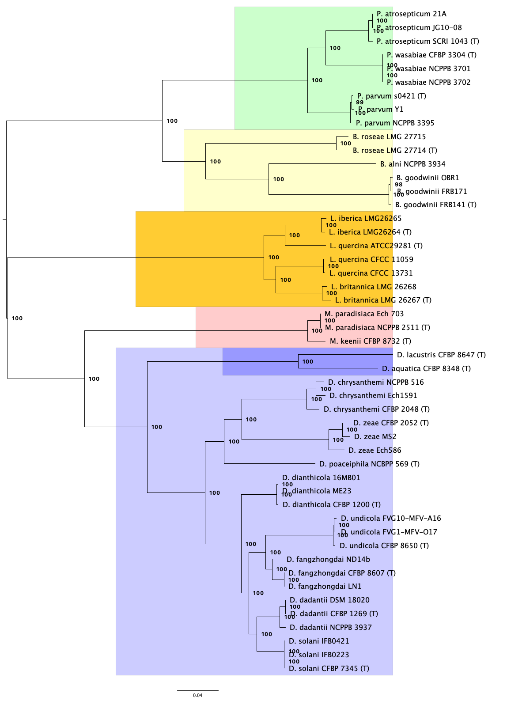

# SI_Hugovieux-Cotte-Pattat_2021

[](https://doi.org/10.5281/zenodo.4546299)

This repository contains supporting material relating to phylogenetic and `pyani` analyses of the *Dickeya*/*Musicola* genus, as reported in:

> Hugovieux-Cotte-Pattat, N., Jacot-des-Combes, C., Briolay, J. & Pritchard, L. (2021) "Proposal for the creation of a new genus *Musicola* gen. nov., reclassification of *Dickeya paradisiaca* (Samson et al. 2005) as *Musicola paradisiaca* comb. nov. and description of a new species *Musicola keenii* sp. nov." *Int. J. Syst. Evol. Microbiol.*



------------------------------------------
## How to use this repository

You can use this repository like a [website](https://widdowquinn.github.io/SI_Hugouvieux-Cotte-Pattat_2021/), to browse and see how we performed the analysis, or you can download it to inspect, verify, reproduce, or build on our analysis.

### Downloading this repository

You can use `git` to *clone* this repository to your local hard drive:

```bash
git clone git@github.com:widdowquinn/SI_Hugouvieux-Cotte-Pattat_2021.git
```

Or you can download it as a compressed `.zip` archive from [this link](https://github.com/widdowquinn/SI_Hugouvieux-Cotte-Pattat_2021/archive/refs/heads/main.zip).

## If You Have Problems With This Repository

Please raise an issue at the corresponding `GitHub` page:

- [Issues for this repository](https://github.com/widdowquinn/SI_Hugouvieux-Cotte-Pattat_2021/issues)

-------------------------------

## Reproducing analyses (quickstart)

You can use this archive to browse, validate, reproduce, or build on the phylogenomics analysis for the Hugovieux-Cotte-Pattat *et al.* (2021) manuscript. We recommend creating a `conda` environment specific for this activity, for example using the commands:

```bash
conda create --name musicola python=3.8 -y
conda activate musicola
conda install --file requirements.txt -y
```

All scripts used to generate the phylogenomic analysis are found in the `scripts/` subdirectory, and can be run in order to regenerate the analysis:

```bash
scripts/download_genomes.sh
scripts/annotate_genomes.sh
scripts/run_anim.sh
scripts/find_orthologues.sh
scripts/align_scos.sh
python scripts/extract_cds.py
scripts/backtranslate.sh
python scripts/concatenate_cds.py
scripts/build_tree.sh
```

---------------------------------------------

## Directory Structure

```bash
$ tree -d
.
├── figure_2     # pyani output generated for figure 2
├── figure_3     # phylogenomics support for figure 3
├── figure_S3    # pyani output generated for figure S3
├── figure_S4    # pyani output generated for figure S4
├── figures      # PDF files of annotated figures from the publication
├── pyanidb      # pyani database generated for figures 2,S3,S4
├── scripts      # scripts used for phylogenomics and other analyses
└── sequences    # FASTA sequences used to produce 16S and gapA trees
$ tree -d
.
├── figure_2     # pyani output generated for figure 2
├── figure_S3    # pyani output generated for figure S3
├── figures      # PDF files of annotated figures 2 and S3
├── pyanidb      # pyani database generated for figures S2/S3
└── sequences    # FASTA sequences used to produce 16S and gapA trees
```

## Reproducing Analyses

### 1. Whole-genome ANIm of *Dickeya* and *Brenneria*, Figures 2 and S3

The complete procedure for producing figures 2 and S3, the whole-genome ANIm of *Dickeya* and *Brenneria* spp. is described in [`figure2.md`](./figure2.md).

The graphical outputs relevant to figure 2 and figure S3 are presented in the directories `figure_2` and `figure_S3`, respectively, and `pyani` database (readable by `pyani` v0.3) generated in the analysis is located in `pyanidb/pyanidb_fig2_figS3`.

The complete ANIm analysis, including input data, is provided in the compressed `.zip` archive `figure_2_figure_S3.zip`, which may be downloaded from [DOI:10.6084/m9.figshare.14770197](https://doi.org/10.6084/m9.figshare.14770197).

### 2. Phylogenomic analysis of *Pectobacteriaceae*, Figure 3

The complete phylogenomic analysis of 49 *Pectobacteriaceae* genomes, including input data, is provided in the compressed `.zip` archive `phylogenomics.zip`, which may be downloaded from [10.6084/m9.figshare.14770647](https://doi.org/10.6084/m9.figshare.14770647). The complete procedure is outlined in the file [`phylogenomics_text.md`](./phylogenomics_text.md). The procedure is described fully in the `README.md` file of the `phylogenomics.zip` archive, and all scripts are provided in the `scripts/` subdirectory of the same archive.

Figure 3, the phylogenetic tree describing the relationship of *Musicola* to the other *Pectobacteriaceae* is provided in the `figures/` directory, and corresponds to the file `figures/core_genome_tree_bs_colour.pdf` in the `phylogenomics.zip` dataset. The concatenated single-copy orthologues, partition file, `raxml-ng` output, log files, and `FigTree` output are in the `figure_3/` subdirectory.

Figure S4, the ANIm analysis of *Pectobacteriaceae*, is split into two files: `figures/figure_S4_a.pdf` and `figures/figure_S4_b.pdf`. These correspond to the files `anim_output/matrix_identity_run1.pdf` and `anim_output/matrix_coverage_run1.pdf` from the `phylogenomics.zip` dataset, respectively. The complete `pyani` ANIm output and log files for this analysis are in the `figure_S4/` subdirectory, and the `pyani` database (readably by `pyani` v0.3) is provided as the `pyanidb/pyanidb_fig_S4` file.


### Licensing

This repository is licensed under the [MIT License](./LICENSE), and copyright (C) 2020-2021 University of Strathclyde

If you use elements of this repository in your own work, we would be grateful if you please cite the following publication, and the URL/DOI of this repository, as "appropriate credit".

> Hugovieux-Cotte-Pattat, N., Jacot-des-Combes, C., Briolay, J. & Pritchard, L. (2021) "Proposal for the creation of a new genus *Musicola* gen. nov., reclassification of *Dickeya paradisiaca* (Samson et al. 2005) as *Musicola paradisiaca* comb. nov. and description of a new species *Musicola keenii* sp. nov." *Int. J. Syst. Evol. Microbiol.*

[](https://doi.org/10.5281/zenodo.4546299)
